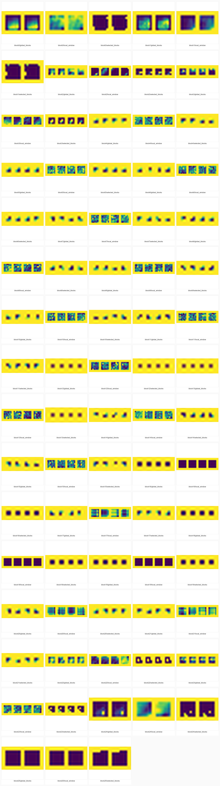

# TCSAFormer

**Efficient Vision Transformer with Token Compression and Sparse Attention for Medical Image Segmentation**

---

## 🚀 Overview
TCSAFormer is a U-Net style Transformer architecture designed for **efficient and accurate medical image segmentation**.  
It tackles the high computational cost of self-attention and the limited spatial modeling of standard FFNs by introducing:

- **Compressed Attention (CA):** Reduces redundant tokens and applies sparse attention.  
- **Dual-Branch Feed-Forward Network (DBFFN):** Captures local + regional features with parallel convolutional branches.  

---

## 🏗️ Architecture

### Overall Design
- **U-shaped encoder–decoder** with skip connections.  
- **Patch Embedding / Merging / Expanding** for multiscale feature extraction.  
- Each stage built from **TCSAFormer blocks**, containing:  
  - Depthwise conv (3×3) for local positional encoding.  
  - **Compressed Attention (CA).**  
  - **DBFFN (Dual-Branch FFN).**  
  - LayerNorm + residual connections.  

Number of blocks per stage: `[2, 2, 8, 1, 1, 8, 2, 2]`.

---

### 🔹 Compressed Attention (CA)
Efficient attention module with three steps:

1. **Token Compression Pipeline (TCP)**  
   - *Prune*: Remove unimportant tokens using importance scores.  
   - *Merge*: Fuse redundant tokens via similarity graph matching.  

2. **Top-k Sparse Attention**  
   - Each query attends only to its top-k most relevant keys.  
   - Reduces quadratic cost to near-linear.  

3. **Token Decompression Pipeline (TDP)**  
   - Unmerge + restore pruned tokens through residual shortcut.  
   - Recovers full token set for downstream processing.  

---

### 🔹 Dual-Branch FFN (DBFFN)
Replacement for vanilla Transformer FFN:

- `1×1 conv` → channel mixing.  
- Two parallel branches:  
  - **3×3 depthwise conv** → fine local features.  
  - **7×7 depthwise conv** → coarse regional features.  
- Concatenate + fuse → `1×1 conv` → output.  

Provides **multi-scale spatial feature extraction** inside the Transformer block.

---

## 📊 Key Benefits
- ✅ Reduced FLOPs & parameters vs. standard ViTs.  
- ✅ Strong segmentation accuracy on **ISIC-2018, CVC-ClinicDB, Synapse** datasets.  
- ✅ Better trade-off between efficiency and accuracy.  
- ⚡ Modular design: CA + DBFFN can be reused in other architectures.  

---

## 🔧 My Modification: Spatial-Sparse Block (**SSBlock**)

To make the architecture more **straightforward while still efficient**, I replaced the original TCSAFormer block with a unified **SSBlock**, inspired by **bi-level sparse attention works (e.g. BiFormer, BigBird, Focal Transformer)**.

### Key Features of SSBlock
- **Three Attention Paths**:  
  1. **Compressed Global** — attention over all block means (global summaries).  
  2. **Selective Global** — attention restricted to top-k most relevant blocks.  
  3. **Local Window** — per-query sliding window attention for fine detail.  

- **Gated Fusion**: A learned gating mechanism mixes the three attention outputs adaptively.  
- **DBFFN Inside**: Retains the dual-branch convolutional FFN (3×3 + 7×7).  
- **Logging-friendly**: Exposes intermediate tensors (block indices, attention maps) for analysis.  
- **Encoder/Decoder Compatible**: Same block works in both stages.  

### Advantages
- ✅ Simplified design (one unified block for all stages).  
- ✅ Keeps global, sparse, and local context jointly.  
- ✅ Still efficient: avoids quadratic attention cost.  
- ✅ More transparent for debugging and profiling.  

# Training Overview (CVC-ClinicDB) — TCSAFormer + SSBlock

I trained the model on **CVC-ClinicDB** locally with a **5070 Ti**, following the official dataset split used in the paper.  

---

## 📦 Dataset & Split
- Dataset: **CVC-ClinicDB** (colon polyp segmentation).  
- Contains **612 images total**:  
  - **485 for training**  
  - **62 for validation**  
  - **65 for testing**  
- Each mask is a **single-channel PNG** where pixel values are **class indices** (background = 0, polyp = 1).  
- Filenames between `images/` and `masks/` must match (same stem).  

---

## 🧼 Preprocessing & Augmentation
For each sample I:
1. **Resize** image and mask to a fixed square resolution (e.g., **256×256**).  
2. **Convert to tensors** (images normalized to `[0,1]`).  
3. Apply **training-only augmentations**:  
   - Random **horizontal** and **vertical flips**  
   - Small **rotations** (±15°)  
   - **Cutout / Random Erasing** on the image to improve robustness  

Validation samples are **not** augmented (only resized).

---

## 🧠 Model & Loss
- Model: **TCSAFormer** (with my streamlined **SSBlock** inside encoder/decoder).  
- Classes: **2** (background, polyp) for CVC-ClinicDB (binary mode).  
- Loss: either **Cross-Entropy** or **CE + Dice**; for ClinicDB I used **CE** in the base run, and **CE+Dice** for multi-class datasets like Synapse.  

I also report **Dice** during validation as the main segmentation quality metric.

---

## ⚙️ Optimization
- Optimizer: **Adam** or **AdamW**  
- Base learning rate: **1e-4**, with optional **cosine** schedule or **ReduceLROnPlateau**  
- **Mixed Precision (AMP)** enabled when possible  
- Optional **gradient clipping** during fine-tuning for stable updates  
- Fixed **seed** for reproducibility  

---

## 🔁 Fine-Tuning Strategy
After training the base model, I **fine-tune** on the same dataset with a **smaller effective LR**.  
I monitor the **validation Dice**: once it **plateaus**, I keep the **best checkpoint** (by Dice) and stop.  

---

## 📈 Learning Curves
Validation Dice (foreground mean) and validation loss across epochs:

  
  

---

## 🖼️ Qualitative Results (Val Set)

**Case 599**  

  
  

**Case 603**  

  
  

> Left: **model output overlay**; Right: **ground truth**.

---

## 🔬 Attention Maps (Last Training Step)
A compact grid of the **latest-step attention visualizations** exported from TensorBoard:

  

---

## ✅ What to expect
- Clean, robust masks even with variable polyp shapes and sizes  
- Stable training with CE (binary) or CE+Dice (multi-class)  
- Fine-tuning provides a small but consistent improvement; I stop on **plateau**  

---

*Trained locally on **5070 Ti**. The same pipeline is reproducible across datasets by swapping presets:  
- **ISIC-2018** (skin lesion segmentation)  
- **Synapse** (multi-organ CT segmentation)  
Only paths and number of classes change; the rest stays the same.*
